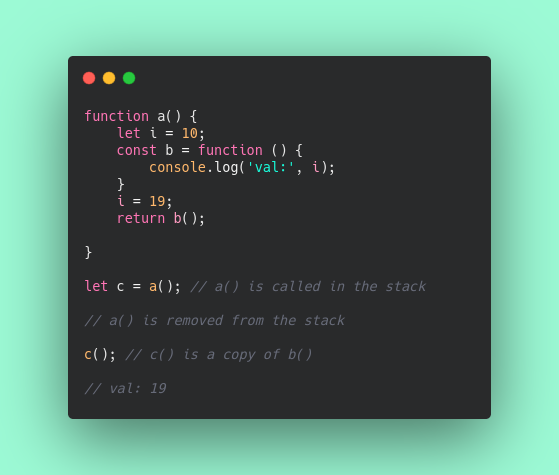
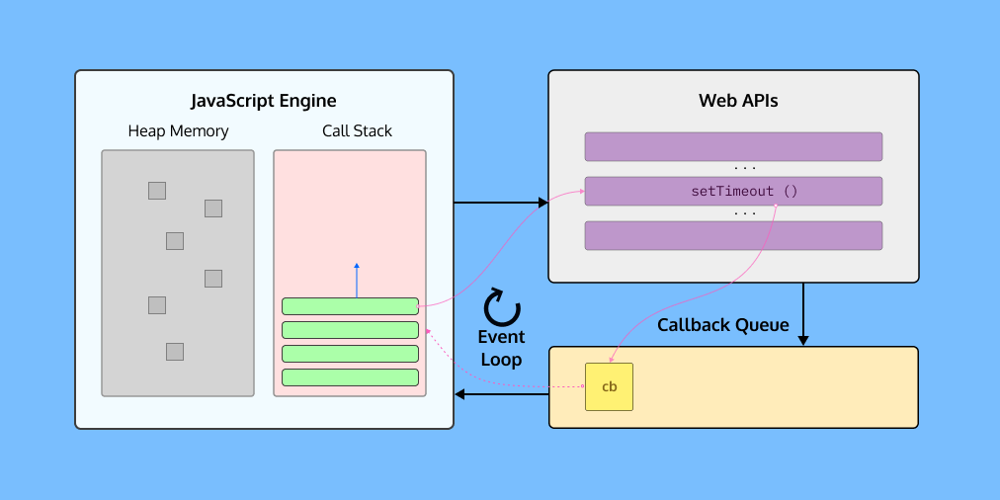

# JavaScript Clouser Property

JavaScript Engines like V8 and SpiderMonkey have a Call Stack where every bit of instruction gets executed.

 

After a function, `a()` gets executed and returned another, function `b()`🧐 gets popped out from the stack. All local variables of function `a()` are also get removed from the stack.

 

Then how comes the function `c()` that is an identical copy of function `b()` is executing the value of variable `i`.

 

It happens because of the Clouser. Clouser is the combination of a function and its surrounding state (lexical environment).

 

When a javascript function returns another function, then it just not returns that function but its Clousers. Here function `a()` returns the Clousers of function `b()`.
