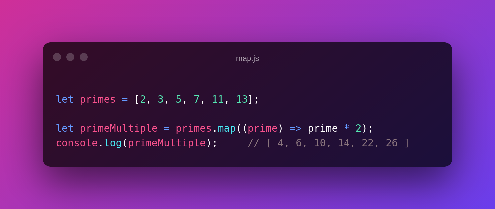
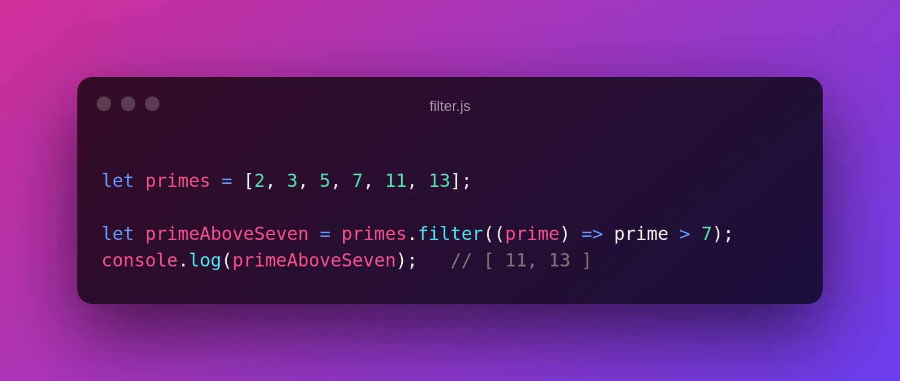
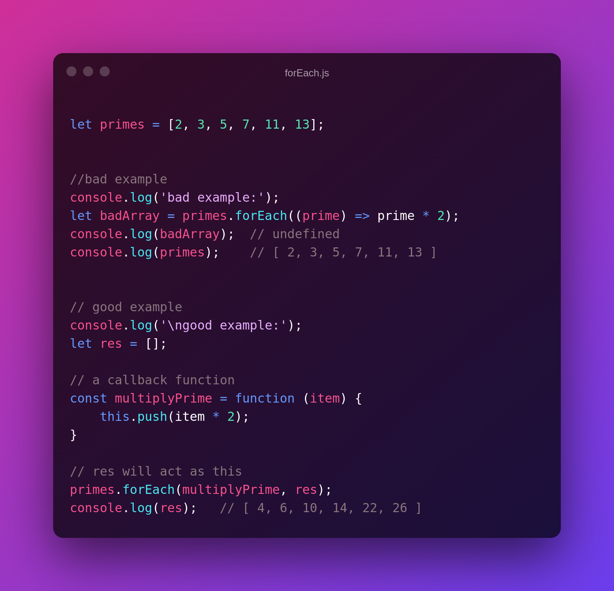
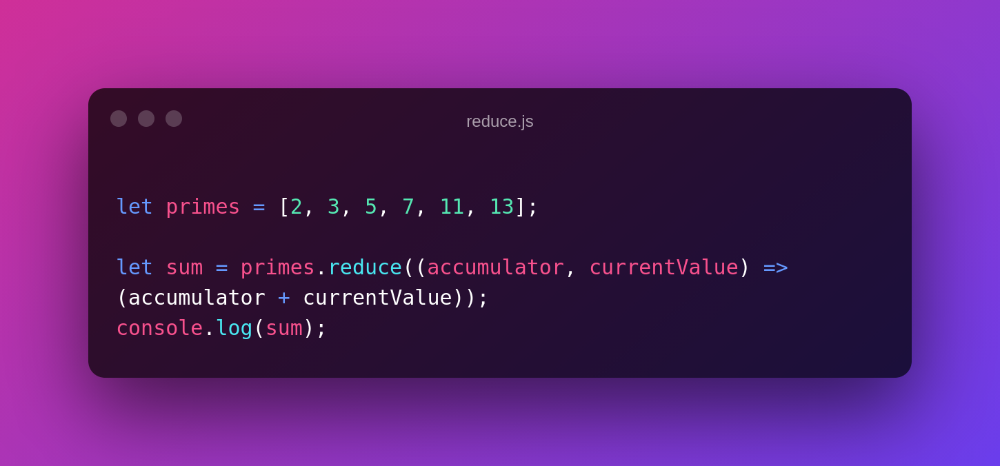

# Higher Order Function of JavaScript Array

Brief explanation of following functions:

:pushpin: `.map()`

:pushpin: `.filter()`

:pushpin: `.forEach()`

:pushpin: `.reduce()`

 

 

1. `.map()`:

This method executes a callback function on each element in an array and returns a new array. The input array remains the same as the initial.

 

2. `.filter()`:

This method performs a callback function on each element in an array with a base condition and, if passed, returns the element to the new array.

 

3. `.forEach()`:

This method is similar to the .map() method, executes callback function on each element of the given Array, but it doesn't return anything (undefined). So if you wish to get the result in the new Array, you need to define it explicitly. Like here:

 

4. `.reduce()`:

This method iterates through an array and returns a single value.

